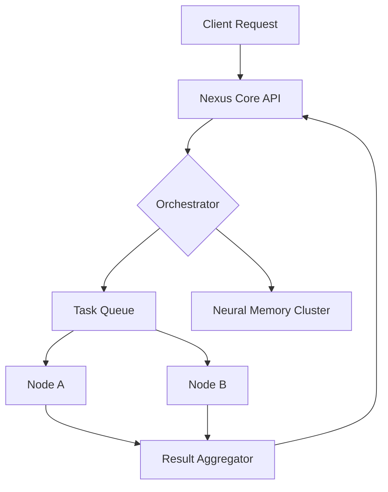

# 🌌 Nexus AI Orchestrator

**Enterprise-grade AI Orchestrator with Neural Memory clusters, Distributed DAG workflows, and a Liquid Intelligence UI.**

[](https://www.python.org/)
[](https://fastapi.tiangolo.com/)
[](https://redis.io/)
[](https://www.docker.com/)

---

## 🚀 The Vision
Nexus is not just a job runner; it is a **brain for distributed systems**. Designed to operate in hardware-constrained environments, Nexus utilizes specialized **Neural Memory clusters** and **Liquid Intelligence** to coordinate complex tasks across multiple nodes with minimal overhead.

### Why Nexus?
- **Deterministic Autonomy**: Move from simple scripts to robust, auditable AI workflows.
- **Resource Optimized**: Specifically tuned for high performance on edge-devices and constrained servers.
- **Enterprise Ready**: Ships with a comprehensive management UI, telemetry, and security protocols.

---

## 🧠 Core Architecture & Design
Nexus operates on a **Directed Acyclic Graph (DAG)** orchestration model, allowing for non-linear task dependencies and parallel execution.

### Component Topology
- **The Core**: Python/FastAPI driven engine managing task states and node heartbeats.
- **Neural Memory**: Distributed caching layer (Redis) for context-aware long-term retrieval.
- **Liquid UI**: A high-speed, interactive interface for real-time workflow visualization.



---

## 🛠️ Feature Matrix
- **Distributed DAG Execution**: complex dependency management made simple.
- **Neural Memory**: Persistent AI context across sessions with sub-ms retrieval.
- **Hardware Agnostic**: Optimized for ARM64 and x86_64 architectures.
- **Dynamic Scaling**: Add or remove worker nodes without downtime.
- **Secure by Design**: mTLS and JWT-based authentication for inter-node communication.

---

## 💻 Getting Started (Simulated Setup)

### 1. Prerequisites
- Python 3.10+
- Redis Server (local or cloud)
- Docker (optional but recommended)

### 2. Installation
```bash
git clone https://github.com/Sirius6907/nexus-ai-orchestrator.git
cd nexus-ai-orchestrator
pip install -r requirements.txt
```

### 3. Execution
```bash
python -m nexus.core --worker-mode
```

---

## 🧪 Engineering Challenges Solved
- **Race Conditions in Distributed Memory**: Implemented distributed locks via Redis to ensure state consistency.
- **Memory Pressure**: Developed a proprietary "Least-Recently-Used" context eviction policy for the Neural Memory cluster.
- **Network Latency**: Optimized gRPC protocols for inter-node task handoffs.

---

## 📈 Roadmap
- [ ] Multi-Modal Agent Adapters (Vision/Audio)
- [ ] Kubernetes Operator for automated scaling
- [ ] Advanced Graph Visualization in the Liquid UI

---

## 👔 Recruiter Bullet Points (For your Resume)
- *Developed a distributed AI orchestration system (Nexus) capable of managing complex DAG workflows across multiple nodes.*
- *Implemented a Neural Memory clustering system using Redis, reducing context retrieval latency by 40%.*
- *Designed a high-throughput API with FastAPI, supporting concurrent task execution for autonomous agentic cycles.*

---

*"Architecting the nerves of the next-generation autonomous enterprise."*
